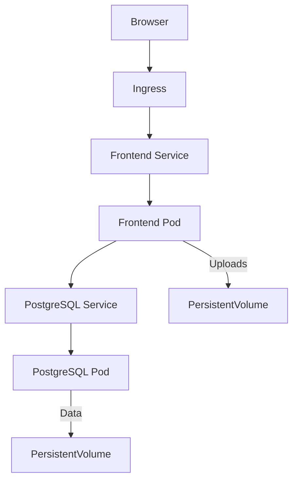

# PhotoVerify - QR Photo Verification


A cloud-native web application for securing and verifying photo authenticity via QR codes, deployed with Kubernetes.

## ✨ Key Features

| Feature | Description |
|---------|-------------|
| **Secure Upload** | Add photos with metadata (title, date, description) |
| **QR Generation** | Automatic unique QR code for each image |
| **Public Verification** | Verify authenticity via QR scan |
| **Gallery Management** | View, download QR codes, or delete entries |

## 🚀 Quick Start

```bash
# Development
npm install
npm run dev

# Production (Docker)
docker-compose up --build

# Kubernetes (Minikube)
cd k8s && ./deploy.sh
```

## 📦 Tech Stack

- **Frontend**: Next.js 16, React 19, Tailwind CSS
- **Backend**: Next.js API Routes
- **Database**: PostgreSQL 15
- **Infrastructure**:
  - Docker (multi-stage builds)
  - Kubernetes (Deployments, Services, PV/PVC)
  - Minikube for local cluster

## 🖥️ Architecture



## 📂 Project Structure

```
├── app/               # Next.js application
├── k8s/               # Kubernetes manifests
│   ├── deployments/   # Pod configurations
│   ├── services/      # Networking
│   ├── volumes/       # Persistent storage
│   └── ingress.yaml   # Routing rules
├── prisma/           # Database schema
└── docs/             # Documentation
```

## 🔧 Deployment Guides

### Kubernetes (Minikube)

```bash
minikube start
minikube addons enable ingress

# Build and deploy
docker build -t photoverify-app:latest .
kubectl apply -f k8s/

# Access application
minikube service frontend-service -n photoverify
```

### Useful Commands

```bash
# View logs
kubectl logs -f deployment/frontend -n photoverify

# Database access
kubectl exec -it deployment/postgres -n photoverify -- psql -U photoverify

# Cleanup
kubectl delete namespace photoverify
```

## 📄 Documentation

Full technical report available in [docs/final_report.pdf](docs/final_report.pdf)

## 🌐 Repository

https://github.com/BamlakT/PhotoVerify-K8s
